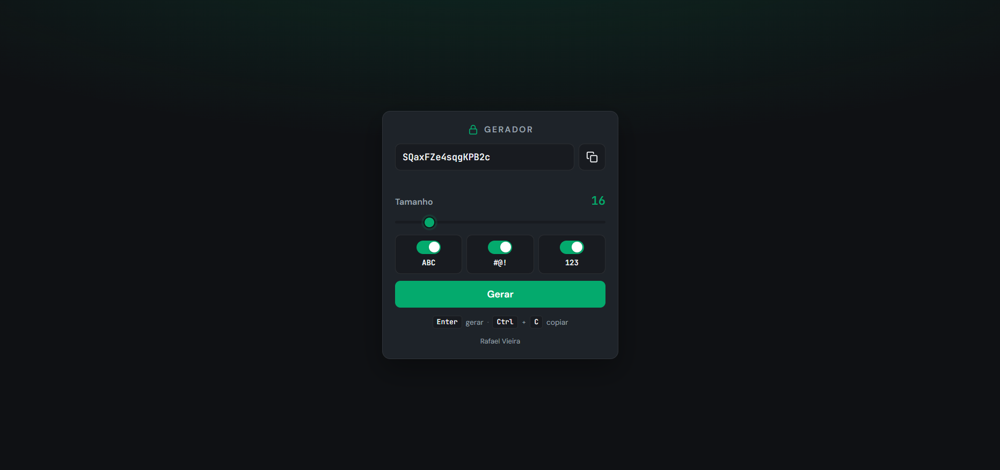
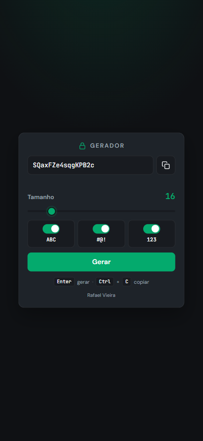

# Gerador de Senha

Aplicação web leve para criar senhas aleatórias com um clique. Roda no navegador, sem backend e sem instalação — ideal para uso rápido no dia a dia.

**Demo (v2):** [password-generator-rafael.netlify.app](https://password-generator-rafael.netlify.app)

**Versão anterior (v1, ~2022):** [legacy/v1](legacy/v1/index.html) · [ver no GitHub](https://github.com/RafaelHDSV/Password-Generator/tree/main/legacy/v1) · detalhes em [legacy/README.md](legacy/README.md)

## O que faz

- Gera senhas entre **8 e 64 caracteres** (padrão: 16).
- Inclui **minúsculas** em toda senha; **maiúsculas**, **símbolos** (`*&$#@!`) e **números** vêm ativados por padrão, como no uso habitual.
- **Salva preferências** no `localStorage` do navegador (tamanho e opções de caracteres).
- **Copia** a senha para a área de transferência com feedback visual.
- Atalhos: **Enter** gera nova senha; **Ctrl+C** (ou **Cmd+C** no Mac) copia a senha atual.
- Senha gerada automaticamente ao abrir a página.

A aleatoriedade usa a API [`crypto.getRandomValues`](https://developer.mozilla.org/pt-BR/docs/Web/API/Crypto/getRandomValues), mais adequada que `Math.random()` para esse tipo de uso.

## Pré-requisitos

Qualquer navegador moderno (Chrome, Firefox, Edge, Safari). Não é necessário Node.js nem build.

## Como executar localmente

1. Clone o repositório:

```bash
git clone https://github.com/RafaelHDSV/Password-Generator.git
cd Password-Generator
```

2. Abra o `index.html` no navegador (duplo clique no arquivo ou servidor estático local).

**Servidor local opcional** (evita restrições em alguns recursos ao abrir por `file://`):

```bash
# Python 3
python -m http.server 8080

# Node (npx, sem instalar globalmente)
npx serve .
```

Acesse `http://localhost:8080` (ou a porta indicada pelo comando).

## Estrutura do projeto

```
.
├── index.html      # marcação e interface
├── style.css       # layout e tema escuro
├── script.js       # geração, cópia e preferências
├── images/         # logo e capturas (v1)
├── legacy/         # versao 2022 preservada (v1)
│   └── v1/
├── .github/        # templates de issues
├── CONTRIBUTING.md
├── CODE_OF_CONDUCT.md
├── SECURITY.md
└── LICENSE
```

## Capturas de tela (v1 — antes)

| Desktop | Mobile |
| --- | --- |
|  |  |

> Interface de 2022. A **v2** está na demo principal; a **v1** continua acessível em [`legacy/v1/`](legacy/v1/index.html) para comparar evolução.

## Stack

- HTML5 semântico
- CSS (variáveis customizadas, Flexbox, tema responsivo)
- JavaScript (Vanilla ES6+)
- Fontes: [DM Sans](https://fonts.google.com/specimen/DM+Sans) e [JetBrains Mono](https://fonts.google.com/specimen/JetBrains+Mono) via Google Fonts

## Privacidade e segurança

- As senhas são geradas **no seu dispositivo**; nada é enviado a servidor.
- Preferências ficam apenas no **navegador local** (`localStorage`).
- O projeto é uma ferramenta de apoio; use senhas únicas por serviço e um gerenciador de senhas quando possível.

Detalhes de reporte de vulnerabilidades: [SECURITY.md](SECURITY.md).

## Contribuindo

Sugestões e correções são bem-vindas. Leia [CONTRIBUTING.md](CONTRIBUTING.md) e o [Código de Conduta](CODE_OF_CONDUCT.md) antes de abrir uma issue ou pull request.

## Licença

Este projeto está sob a licença MIT. Veja [LICENSE](LICENSE).

## Autor

**Rafael Henrique de Sousa Vieira** — [GitHub](https://github.com/RafaelHDSV)
